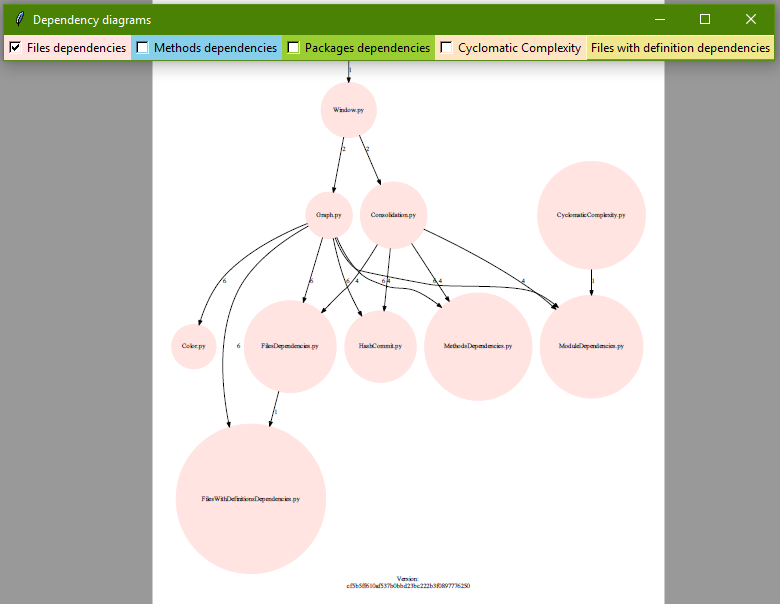

# Dependency_diagrams
Simple app to generate dependency diagrams for python code.

 

## Technologies
- Python 3.7
- Tkinter
- Graphviz 0.13.2
- Radon 4.0.0
- GitPython 3.0.5
- Repo 0.1.0

## Features
Making diagram with dependencies between files, methods and packages.

## Installation
- Clone this repo to your local machine
- To run this project, open Main.py
